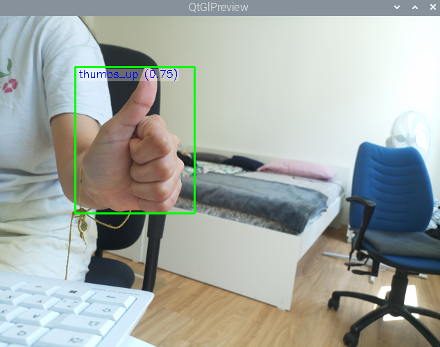
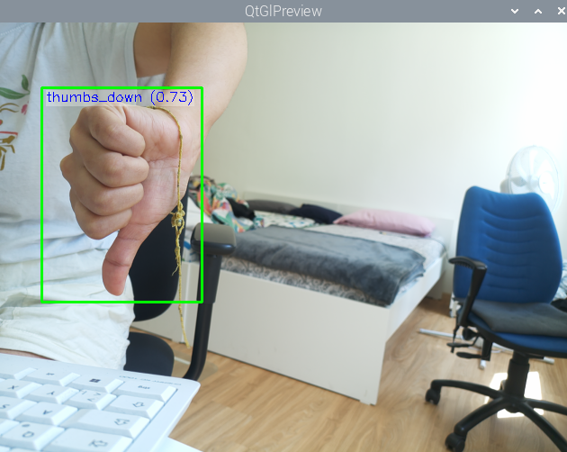
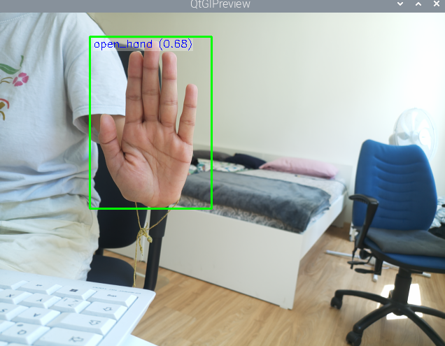

# Gesture Detection AISD Project
**Deggendorf Institute of Technology**  
Course: AISD  
Team: aisd_user12

---

## Project Overview
This project implements a real-time hand gesture detection system using a Raspberry Pi 5 with an IMX500 AI Camera. The system detects three hand gestures:
- ✋ `open_hand` - Open hand with fingers spread
- 👍 `thumbs_up` - Thumb pointing up
- 👎 `thumbs_down` - Thumb pointing down

---

## Workflow

```
Capture Images → Label Data → Train YOLO Model → Export to IMX → Run on Raspberry Pi
```

---

## Project Structure

```
Gesture_Detection_AISD/
├── dataset/
│   └── raw/
│       ├── thumbs_up/        # 100 images
│       ├── thumbs_down/      # 100 images
│       └── open_hand/        # 100 images
├── my_training_data/         # Labeled training data (exported from Label Studio)
│   ├── images/               # 299 annotated image files
│   ├── labels/               # 299 YOLO annotation files
│   ├── classes.txt           # Class names
│   └── notes.json            # Label metadata
├── packerOut.zip             # IMX500 deployment package
├── labels.txt                # Class labels for deployment
├── best.pt                   # Trained YOLO model weights
├── collect_images.py         # Script to capture images via webcam
└── README.md                 # This file
```

---

## Step 1 - Data Collection

Images were captured using a laptop webcam using OpenCV:

```bash
pip install opencv-python
python collect_images.py
```

Edit `collect_images.py` before each run:
```python
gesture_name = "thumbs_up"   # change to: thumbs_down / open_hand
total_needed = 100
```

- **300 images collected in total** (100 per gesture)
- 299 images successfully annotated and exported (1 skipped in Label Studio)
- Variety tips applied: different distances, angles, lighting conditions

---

## Step 2 - Data Labeling

Images were labeled using **Label Studio**:

```bash
pip install label-studio
label-studio
```

- Project type: **Object Detection with Bounding Boxes**
- Labels added: `open_hand`, `thumbs_up`, `thumbs_down`
- Drew tight bounding boxes around each hand
- Rule: label if >30% of hand is visible
- Exported in **YOLO with Images** format
- Result: 299 labeled images with matching `.txt` annotation files

---

## Step 3 - Data Preparation (Linux Workstation)

SSH into the Linux workstation:

```bash
ssh aisd_user12@10.1.65.207
```

Transfer dataset from laptop:

```bash
scp -r my_training_data aisd_user12@10.1.65.207:/home/aisd_user12/
```

Prepare training data:

```bash
cd yolo-uv
uv run python prepare_training_data.py
```

Edit `prepare_training_data.py` paths:
```python
datapath = "/home/aisd_user12/my_training_data"
outputpath = "./data"
train_pct = 0.8
path_to_classes_txt = "/home/aisd_user12/my_training_data/classes.txt"
path_to_data_yaml = "/home/aisd_user12/yolo_config.yaml"
```

This splits data into:
- **80% training → 239 images**
- **20% validation → 60 images**

And creates `yolo_config.yaml`:

```yaml
train: /home/aisd_user12/yolo-uv/data/train/images
val: /home/aisd_user12/yolo-uv/data/val/images
nc: 3
names:
- open_hand
- thumbs_down
- thumbs_up
```

---

## Step 4 - Model Training (Linux Workstation)

Train the YOLO11n model:

```bash
uv run python train.py
```

`train.py` configuration:
```python
from ultralytics import YOLO
model = YOLO('yolo11n.pt')
model.train(
    data="/home/aisd_user12/yolo_config.yaml",
    epochs=150,
    imgsz=640,
    batch=16
)
```

Training results achieved:

| Class | Images | Precision | Recall | mAP50 | mAP50-95 |
|-------|--------|-----------|--------|-------|----------|
| all | 109 | 0.998 | 1.0 | 0.995 | 0.900 |
| thumbs_up | 46 | 0.999 | 1.0 | 0.995 | 0.900 |
| thumbs_down | 29 | 0.998 | 1.0 | 0.995 | 0.852 |
| open_hand | 34 | 0.997 | 1.0 | 0.995 | 0.948 |

Output: `runs/detect/train-8/weights/best.pt`

---

## Step 5 - Export to IMX Format (Linux Workstation)

Install export tools:

```bash
uv pip install "edge-mdt-cl[torch]" model_compression_toolkit mct-quantizers
```

Export model:

```bash
uv run python yolo_export.py \
  --init_model runs/detect/train-8/weights/best.pt \
  --export_format imx \
  --export_only \
  --int8_weights
```

Output: `runs/detect/train-8/weights/best_imx_model/packerOut.zip`

Download to laptop:

```bash
scp aisd_user12@10.1.65.207:/home/aisd_user12/yolo-uv/runs/detect/train-8/weights/best_imx_model/packerOut.zip ./
scp aisd_user12@10.1.65.207:/home/aisd_user12/yolo-uv/runs/detect/train-8/weights/best_imx_model/labels.txt ./
scp aisd_user12@10.1.65.207:/home/aisd_user12/yolo-uv/runs/detect/train-8/weights/best.pt ./
```

---

## Step 6 - Convert to RPK (Raspberry Pi)

Install IMX tools (already installed):

```bash
sudo apt install imx500-all
```

Convert to RPK:

```bash
imx500-package -i /home/pi/packerOut.zip -o /home/pi/output_model/
```

Output: `/home/pi/output_model/network.rpk`

> **Note:** `labels.txt` must match the class order used during training:
> ```
> open_hand
> thumbs_down
> thumbs_up
> ```

---

## Step 7 - Run Gesture Detection (Raspberry Pi)

```bash
cd picamera2/examples/imx500/
python imx500_object_detection_demo.py \
  --model /home/pi/output_model/network.rpk \
  --labels /home/pi/labels.txt \
  --fps 25 \
  --bbox-normalization \
  --ignore-dash-labels \
  --bbox-order xy
```

---

## Results

The system successfully detects all 3 gestures in real-time:

| Gesture | Training mAP50 | Deployed Confidence |
|---------|---------------|---------------------|
| thumbs_up | 0.995 | 0.75 |
| thumbs_down | 0.995 | 0.73 |
| open_hand | 0.995 | 0.68 |

> ⚠️ Confidence drop from training to deployment is expected and normal. The IMX500 uses **INT8 quantization** to compress the model for embedded hardware, which reduces precision scores. This is a standard trade-off in edge AI deployment.

### 👍 Thumbs Up Detection


### 👎 Thumbs Down Detection


### ✋ Open Hand Detection


---

## Constraints & Limitations

- **INT8 Quantization**: Model quantized to 8-bit integers for IMX500, reducing confidence from 99.5% to ~77%
- **Calibration Data**: INT8 calibration used only 4 COCO images (export tool limitation); more calibration images would improve accuracy
- **Fixed Camera**: System assumes relatively fixed camera position and orientation
- **Lighting Sensitivity**: Performance degrades in poor or inconsistent lighting
- **Label Order**: `labels.txt` on the Pi must exactly match the class order from training `classes.txt` — mismatches cause wrong gesture labels

---

## Possible Improvements

- Use gesture-specific calibration images for INT8 export instead of default COCO images
- Collect more images with varied backgrounds, lighting, and skin tones
- Add more gesture classes (peace sign, fist, pointing finger, etc.)
- Implement gesture-based control for a real application (media control, smart home, etc.)
- Apply additional data augmentation during training (rotation, brightness, contrast)

---

## Hardware Used
- Personal Laptop (Windows) with webcam — data collection
- Linux Workstation with NVIDIA RTX A5000 GPU — model training
- Raspberry Pi 5 (8GB) — deployment
- Raspberry Pi AI Camera (IMX500) — real-time inference

## Software Used
- Python 3.10
- Ultralytics YOLO 8.4.51
- PyTorch 2.4.1 + CUDA 12.1
- Label Studio — annotation
- OpenCV — image capture
- `uv` — Python environment manager
- `edge-mdt-cl`, `model_compression_toolkit` — IMX500 export
- `picamera2` — Raspberry Pi camera interface

---

## References
- [Ultralytics YOLO Documentation](https://docs.ultralytics.com)
- [Sony IMX500 Export Guide](https://docs.ultralytics.com/integrations/sony-imx500/)
- [Label Studio](https://labelstud.io/)
- Project Guidance — Prof. Dr. Thomas Ewender, DIT