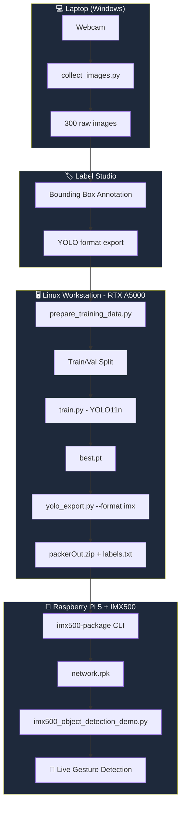
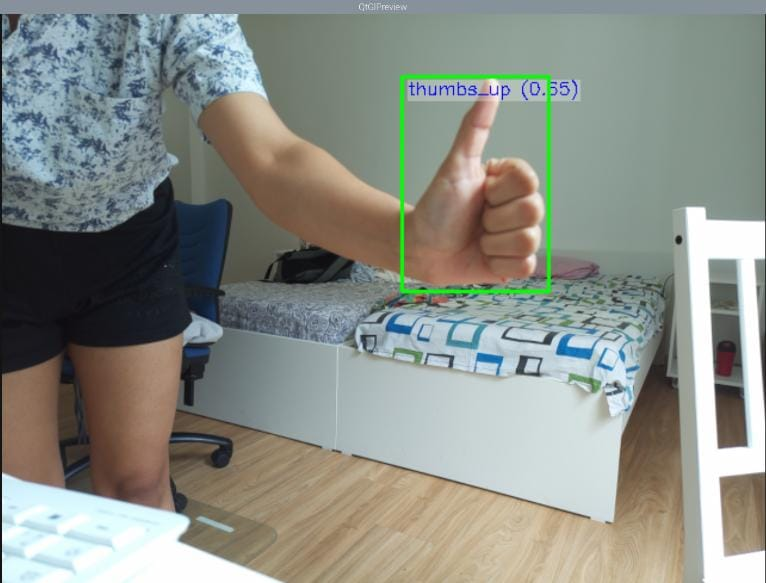
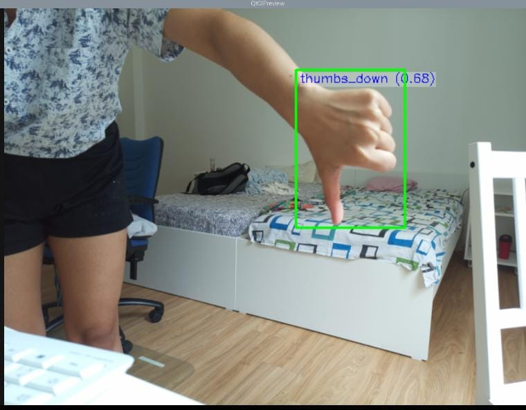
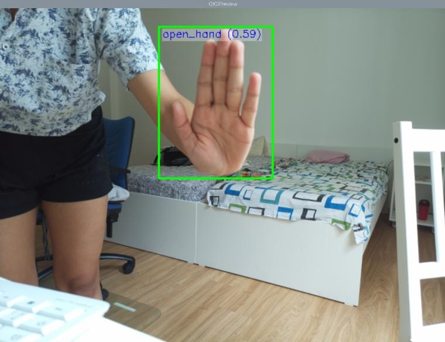

<div align="center">

# ✋👍👎 Gesture Detection AISD

### Real-Time Hand Gesture Recognition on Raspberry Pi 5 + IMX500 AI Camera

**Deggendorf Institute of Technology** · Course: AISD · Team: `aisd_user12`

[](https://www.python.org/)
[](https://docs.ultralytics.com)
[](https://www.raspberrypi.com/)
[](https://docs.ultralytics.com/integrations/sony-imx500/)
[](LICENSE)

</div>

---

## 📌 Project Overview

This project implements a real-time, on-device hand gesture detection system using a **Raspberry Pi 5** paired with the **Sony IMX500 AI Camera**, which runs neural network inference directly on the camera sensor. A custom-trained **YOLO11n** model detects three hand gestures with no cloud or host-side inference required.

| Gesture | Emoji | Description |
|---|---|---|
| `open_hand` | ✋ | Open hand, fingers spread |
| `thumbs_up` | 👍 | Thumb pointing up |
| `thumbs_down` | 👎 | Thumb pointing down |

---

## 🔄 Workflow

```mermaid
flowchart LR
    A[📷 Capture Images] --> B[🏷️ Label Data]
    B --> C[✂️ Split Train/Val]
    C --> D[🧠 Train YOLO11n]
    D --> E[📦 Export to IMX]
    E --> F[🍓 Convert to RPK]
    F --> G[🎯 Run on Raspberry Pi]

    style A fill:#FFB74D,color:#000
    style B fill:#4FC3F7,color:#000
    style C fill:#4FC3F7,color:#000
    style D fill:#64B5F6,color:#000
    style E fill:#FFD54F,color:#000
    style F fill:#81C784,color:#000
    style G fill:#81C784,color:#000
```



---

## 🏗️ System Architecture



---

## 📁 Project Structure

```
Gesture_Detection_AISD/
├── dataset/raw/
│   ├── thumbs_up/             # 100 images
│   ├── thumbs_down/           # 100 images
│   └── open_hand/             # 100 images
├── Training_data/             # Labeled data (exported from Label Studio)
│   ├── images/                # 372 images (299 gesture + 73 unlabeled negatives)
│   ├── labels/                # 372 YOLO annotation files (73 empty = negatives)
│   ├── classes.txt            # Class names
│   └── notes.json             # Label metadata
├── results/                   # Detection screenshots
├── best.pt                    # Trained YOLO11n weights
├── packerOut.zip              # IMX500 deployment package
├── network.rpk                # Final model for Raspberry Pi
├── labels.txt                 # Class labels for deployment
├── collect_images.py          # Webcam capture script
├── prepare_training_data.py   # Train/val split + YAML generator
├── train.py                   # Training script
├── yolo_export.py             # IMX export script
├── yolo_config.yaml           # YOLO dataset config
├── pyproject.toml             # Python project config + pinned dependencies (3.10)
└── README.md
```

---

## 🧪 Pipeline Walkthrough

### Step 1 · Data Collection

```bash
pip install opencv-python
python collect_images.py
```

```python
gesture_name = "thumbs_up"   # change to: thumbs_down / open_hand
total_needed = 100
```

- **300 gesture images collected** (100 per gesture)
- **299 images** successfully annotated and exported (1 skipped in Label Studio)
- Variety applied: different distances, angles, lighting conditions

**Negative / background images (added after professor consultation):** The initial model was trained and demonstrated using only the 299 labeled gesture images. After reviewing the working prototype, our professor suggested adding unlabeled background images (no hand/gesture present) to help the model distinguish "no gesture" from the three gesture classes and reduce false positives. Following this guidance, **73 random background images** were added to the dataset and intentionally left **unlabeled** (empty `.txt` annotation files), bringing the total dataset to **372 images**.

### Step 2 · Data Labeling

```bash
pip install label-studio
label-studio
```

- Project type: **Object Detection with Bounding Boxes**
- Classes: `open_hand`, `thumbs_up`, `thumbs_down`
- Rule: label if **>30%** of the hand is visible
- Exported in **YOLO with Images** format

### Step 3 · Data Preparation *(Linux Workstation)*

```bash
ssh aisd_user12@10.1.65.207
scp -r Training_data aisd_user12@10.1.65.207:/home/aisd_user12/
cd yolo-uv
uv run python prepare_training_data.py
```

Split result (full dataset, including negatives): **80% train (~297 imgs) / 20% val (~75 imgs)**

`yolo_config.yaml`:
```yaml
train: /home/aisd_user12/yolo-uv/data/train/images
val: /home/aisd_user12/yolo-uv/data/val/images
nc: 3
names:
- open_hand
- thumbs_down
- thumbs_up
```

### Step 4 · Model Training *(Linux Workstation)*

```bash
uv run python train.py
```

```python
from ultralytics import YOLO
model = YOLO('yolo11n.pt')
model.train(
    data="/home/aisd_user12/yolo_config.yaml",
    epochs=150,
    imgsz=640,
    batch=16
)
```

**Training Results (retrained on full 372-image dataset, including 73 background negatives):**

| Class | Images | Instances | Precision | Recall | mAP50 | mAP50-95 |
|---|---|---|---|---|---|---|
| all | 75 | 65 | 0.993 | 1.0 | 0.995 | 0.821 |
| open_hand | 18 | 18 | 0.994 | 1.0 | 0.995 | 0.892 |
| thumbs_down | 28 | 28 | 0.997 | 1.0 | 0.995 | 0.737 |
| thumbs_up | 19 | 19 | 0.988 | 1.0 | 0.995 | 0.834 |

*(Validation set: 75 images, 10 of which are background/negative images with no gesture instance)*

Output → `runs/detect/train-12/weights/best.pt`

### Step 5 · Export to IMX Format *(Linux Workstation, Python 3.10 required)*

```bash
uv pip install "edge-mdt-cl[torch]==1.0.0" "model-compression-toolkit==2.4.5" "mct-quantizers==1.6.0"

uv run python yolo_export.py \
  --init_model runs/detect/train-12/weights/best.pt \
  --export_format imx \
  --export_only \
  --int8_weights
```

Output → `best_imx_model/packerOut.zip` + `labels.txt`

### Step 6 · Convert to RPK *(Raspberry Pi)*

```bash
sudo apt install imx500-all
imx500-package -i /home/pi/Desktop/Project_AISD/Gesture_Detection_AISD/packerOut.zip -o /home/pi/Desktop/Project_AISD/Gesture_Detection_AISD/
```

Output → `network.rpk`

> ⚠️ `labels.txt` order **must** match `classes.txt`: `open_hand`, `thumbs_down`, `thumbs_up`

### Step 7 · Run Gesture Detection *(Raspberry Pi)*

```bash
cd /home/pi/picamera2/examples/imx500/
python imx500_object_detection_demo.py \
  --model /home/pi/Desktop/Project_AISD/Gesture_Detection_AISD/network.rpk \
  --labels /home/pi/Desktop/Project_AISD/Gesture_Detection_AISD/labels.txt \
  --fps 25 \
  --bbox-normalization \
  --ignore-dash-labels \
  --bbox-order xy
```

---

## 📊 Results

```mermaid
xychart-beta
    title "Training mAP50-95 vs Deployed Confidence (INT8, post-retrain)"
    x-axis [open_hand, thumbs_down, thumbs_up]
    y-axis "Score" 0 --> 1
    bar [0.892, 0.737, 0.834]
    bar [0.59, 0.68, 0.55]
```



| Gesture | Training mAP50 | Training mAP50-95 | Deployed Confidence (Pi, INT8) |
|---|---|---|---|
| ✋ open_hand | 0.995 | 0.892 | 0.59 |
| 👎 thumbs_down | 0.995 | 0.737 | 0.68 |
| 👍 thumbs_up | 0.995 | 0.834 | 0.55 |

> The confidence drop from training metrics to deployed inference is expected due to **INT8 quantization**, which compresses the model for embedded hardware and trades some precision for real-time, on-sensor inference speed. Interestingly, deployed confidence values are slightly **lower** after retraining with the added negative/background images compared to the original 299-image model. This is likely because the model has become more conservative — having learned to actively suppress "no gesture" predictions, it now assigns relatively lower confidence even to true positives. This trade-off (lower raw confidence, but fewer expected false positives) is worth discussing as an observation in the presentation rather than treating it as a regression.

### 📸 Live Detection

| Thumbs Up | Thumbs Down | Open Hand |
|---|---|---|
|  |  |  |

---

## ⚠️ Constraints & Limitations

- **INT8 Quantization** — reduces training mAP50 (~99.5%) to deployed confidence of roughly 55-68% on the Pi
- **Calibration Data** — only 4 default COCO images used for INT8 calibration (export tool default); gesture-specific calibration data would likely improve accuracy
- **Negative Sample Size** — 73 unlabeled background images were included to reduce false positives; this is a relatively small set and more diverse negatives (different rooms, objects, hand-like shapes) would further improve robustness
- **Fixed Camera** — assumes a relatively fixed camera position/orientation
- **Lighting Sensitivity** — performance degrades under poor or inconsistent lighting
- **Label Order Sensitivity** — `labels.txt` on the Pi must exactly match the `classes.txt` training order, or gestures get mislabeled

## 🚀 Possible Improvements

- Use gesture-specific calibration images for INT8 export instead of default COCO images
- Collect more images across backgrounds, lighting conditions, and skin tones
- Add more gesture classes (peace sign, fist, pointing finger, etc.)
- Build a real downstream application (media control, smart-home triggers, etc.)
- Apply stronger data augmentation (rotation, brightness, contrast) during training

---

## 🛠️ Hardware & Software

<table>
<tr>
<td valign="top" width="50%">

**Hardware**
- 💻 Laptop (Windows) + webcam — data collection
- 🖥️ Linux Workstation, NVIDIA RTX A5000 — training
- 🍓 Raspberry Pi 5 (8GB) — deployment
- 📷 Raspberry Pi AI Camera (IMX500) — inference

</td>
<td valign="top" width="50%">

**Software**
- Python 3.10.12
- Ultralytics YOLO 8.4.51
- PyTorch 2.4.1 + torchvision 0.19.1 (CUDA 12.1)
- Label Studio — annotation
- OpenCV — image capture
- `uv` — environment manager
- `edge-mdt-cl` 1.0.0, `model-compression-toolkit` 2.4.5, `mct-quantizers` 1.6.0 — IMX500 export
- `picamera2` — Raspberry Pi camera interface

</td>
</tr>
</table>

---

## 📚 References

- [Ultralytics YOLO Documentation](https://docs.ultralytics.com)
- [Sony IMX500 Export Guide](https://docs.ultralytics.com/integrations/sony-imx500/)
- [Label Studio](https://labelstud.io/)
- Project Guidance — Prof. Dr. Thomas Ewender, DIT

<div align="center">

---

</div>